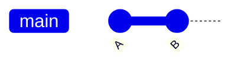
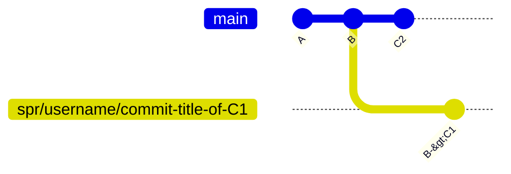
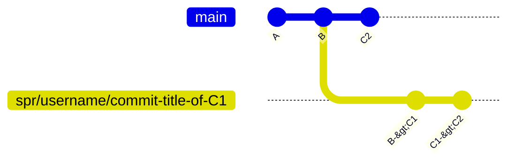
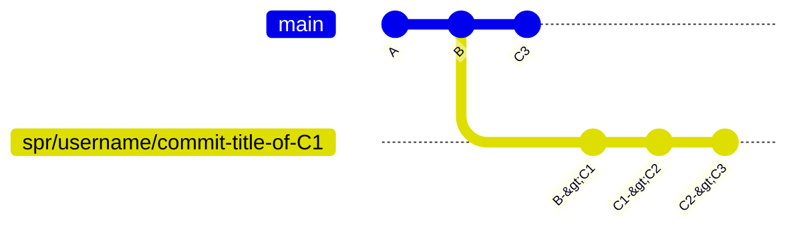
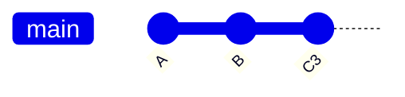

# How it works - Simple PR

This section describes how `spr` works from a git perspective.
This is not required to use `spr`,
but more to understand how it works.

It follows the [simple PR](../user/simple.md) workflow.
Understanding that workflow will help understand the decisions made here.

## Creating the PR

Let's say you have a repo with a `main` branch:

Now you want to make a change.
You make a commit on the `main` branch with your change and the commit id is `C1`:

When you are ready to submit a PR, you run `spr diff` from the head commit of the `main` branch (`C1`).
This will create a transient branch that is only used to create a PR on GitHub:

This `spr/username/commit-title-of-C1` branch is pushed to GitHub and used to open a PR against the `main` branch.
The transient branch is not something you really need to directly interact with;
`spr` takes care of keeping it up to date, creating the correct commits, etc.
All you need to do is continue working on the `main` branch.
Once the PR has been created for the `spr/username/commit-title-of-C1` branch,

The `C1` commit is updated with a few sections from the PR information.
A `Pull Request` section is added that links to the PR that was created.
This allows `spr` to know which branch/PR to update from only the commit.

## Amending the commit

Let's say your PR needed some changes.
What you'd do is make the changes to the commit that the PR was created from (in this case `C1`)
amending the changes to the commit.

The next time that you use `spr diff`,
it will compute the diff from `C1` to `C2`,
and push that to GitHub as an additional commit:

Pushing additional commits to the PR rather than rebasing the commits that are already on the PR works better with GitHub (discussions stay intact, commits aren't lost in the UI, changes between requests can be tracked, etc.).

If you make more changes,
it continues along this path:

## Landing the change

Once you're ready to merge the PR,
you would use `spr land` to merge the PR.
This will perform a squash merge on GitHub for the PR.
Once the branch has been merged on GitHub,
it will update the local `main` branch and delete the transient branch:

